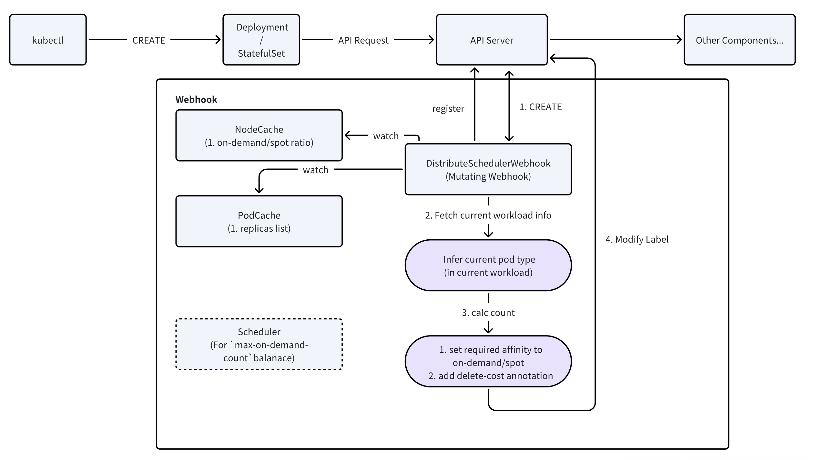
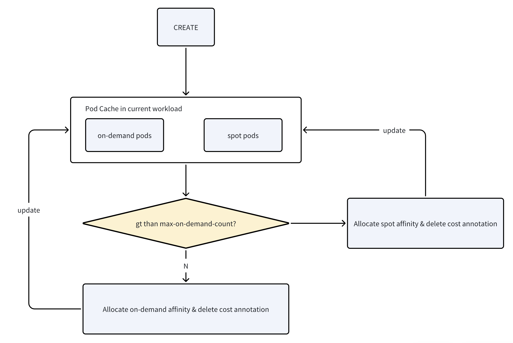

# Distribute Scheduler Design

## Background
Currently, in the cloud-native scenario, we hope to maximize the utilization of the hybrid deployment of on-demand and spot instances (pure spot clusters still pose risks to availability). In addition, considerations need to be made for single-replica and multi-replica situations. Moreover, to minimize modifications to Kubernetes (k8s) itself, we consider using mutating admission webhooks to dynamically modify the affinity of nodes and pods during API requests, thereby simplifying the design and implementation of the scheduler.

## Design
> After discussion, the proportion of on-demand and spot instances within replicas needs to be strictly controlled. Therefore, the required affinity labels should be utilized to implement a more stringent node matching strategy (it may result in some pods being starved of resources and unable to be scheduled, but this is beyond our discussion scope and requires users to expand the node resource pool).

This issue can be directly simplified to setting the proportion of **requiredDuringSchedulingIgnoredDuringExecution** on spot nodes for the deployment/statefulset, that is, setting the "In Spot" label when creating pods to enable the Kubernetes scheduler to strictly match the rules.

An additional condition is that at least one node of each category should be online during operation to ensure availability. For single/multi-replica nodes, pods are initially created on on-demand nodes, and subsequent pod creations are closer to spot nodes to ensure an even distribution. When considering max-on-demand-count = 3 (for the webhook, due to the scheduler & spot reclaim situations, it is relatively difficult to ensure a stable proportion, so we mainly focus on the strict quantity), a cache is established for this workload. When executing the CREATE operation, some pods are set as required on-demand to achieve the expected on-demand quantity (ignoring cases where pods are abnormally scheduled or unhealthy due to node factors).

For the scenario of workload scale changes, that is, scaling up/down the deployment, in the case of scaling down the deployment, it is expected to add a **delete cost** to on-demand/spot pods to reduce the probability of the scheduler actively deleting on-demand pods. The scenario of scaling up the deployment scale is similar to the initial creation of the deployment, and only requires the additional creation of the deployment.

For the hot adjustment of the max-on-demand-count configuration, it will trigger pod reconstruction, and at this time, the affinity configuration on the corresponding pods will be readjusted according to the configuration.

When the replica count is lower than max-on-demand-count, all replicas are considered to be placed on on-demand nodes.

### Config
Regarding some usage considerations, some other webhook configurations can be provided to support enabling/disabling the corresponding scheduling strategies for deployments/stateful sets, directly using manual configurations.
```bash
cloudpilot.ai/webhook-scheduler=true
cloudpilot.ai/webhook-scheduler=false
```

The implementation method is to directly skip the subsequent labeling process for these labels.

To achieve fine-grained control of the number of on-demand/spot instances, the max-on-demand-count configuration needs to be added. Regarding the specificities related to deployment/statefulset mentioned in the Design, they can be implemented according to the replica count and max-on-demand-count during deployment.

> 1. If the replica count is 5 and max-on-demand-count is 5, then all pods are on on-demand nodes.
> 2. If the replica count is 5 and max-on-demand-count is 3, then at most 3 pods are on on-demand nodes and at least 2 pods are on spot nodes.
> 3. If the replica count is 5 and max-on-demand-count is 0, then at least 5 pods are on spot nodes.
> 4. If the replica count is 5 and max-on-demand-count is 7, then at least 5 pods are on on-demand nodes.

```bash
cloudpilot.ai/webhook-scheduler-max-on-demand-count=3
```

### Scheduler
The Design has analyzed how we create strategies for a series of Pods based on the existing scenarios, that is, adding node affinity to pods according to the order of creation for different workloads. Additionally, the affinity here tends to use the requiredDuringSchedulingIgnoredDuringExecution to complete the mandatory affinity configuration.

> 1. There are some deployment differences in deployment/statefulset itself, that is, different tolerances for availability. Especially for components involving master-slave elections, the stability of the master node or half of the nodes may affect the performance of the cluster. Therefore, it is necessary to provide an on-demand count. When providing the YAML, manually specify the expected on-demand quantity to ensure availability.
> 2. Provide a delete cost to enable the scheduler to preferentially delete spot nodes when the replica quantity changes.



As shown in the figure, after starting the webhook, the scheduler itself will list-watch the status of nodes and pods in the cluster and initialize the current Scheduler cache. When receiving a request to create a new pod, it will serialize/deserialize the request and response in the way of the webhook and fill in the configuration of NodeAffinity internally (PodAffinity is not considered for the time being).



The Pod state and the proportion of on-demand in a certain Deployment/Statefulset are maintained in the PodCache. Newly created nodes will calculate the affinity assigned to the current Pod based on the rules in the Design section.

- Consider the following situations:
  - For normal pod creation without any preceding pods being destroyed, the filling is directly completed according to the index.
  - When a pod is scheduled to a spot node and terminated, the scheduler/API server will fill in the first vacant Pod Weight position when creating a new pod.
  - When the webhook is restarted, consider rebuilding the PodCache from the labels of the existing pods.
The NodeCache maintains the status of on-demand/spot nodes and can be used as an offset value for weight calculation. In a simple version, this NodeCache can actually be ignored.

### Strategy
- CREATE
  - Calculate Affinity, calculate whether the current Pod exceeds the number of Pods on on-demand in the PodCache.
```yaml
# For on-demand
affinity:
    nodeAffinity:
      requiredDuringSchedulingIgnoredDuringExecution:
        nodeSelectorTerms:
        - matchExpressions:
          - key: node.kubernetes.io/capacity
              operator: In
              values:
              - on-demand

# For spot
affinity:
    nodeAffinity:
      requiredDuringSchedulingIgnoredDuringExecution:
        nodeSelectorTerms:
        - matchExpressions:
          - key: node.kubernetes.io/capacity
              operator: In
              values:
              - spot
```
- DELETE
  - The expected deletion logic is determined by the cloud vendor, that is, actively shutting down spot nodes, so the delete logic of the Kubernetes scheduler itself is temporarily ignored.
  - When actively adjusting the replica number, provide a delete-cost to preferentially delete pods on spot nodes.
```bash
# Spot
controller.kubernetes.io/pod-deletion-cost=1
# On-demand
controller.kubernetes.io/pod-deletion-cost=100
```

### Take off
This design simplifies the considerations of the Scheduler part. For CREATE requests, the enhanced label configuration of the webhook is utilized to complete the design and implementation of the Scheduler part, so that the Kubernetes native scheduler can complete the affinity scheduling based on the labels. In terms of calculation rules, it can to some extent take into account the availability of on-demand devices and the dynamic expansion capacity of spot devices. Additionally, some configs are provided to dynamically enable or disable the webhook.

However, for the behaviors of the cluster itself, such as scaling up/down, migration, etc., the capabilities implemented by the webhook may not be strong enough, and it is necessary to consider combining other components to achieve a more fine-grained implementation.

### References
- Node Affinity: https://kubernetes.io/docs/concepts/scheduling-eviction/assign-pod-node/
- Admission Webhooks: https://kubernetes.io/blog/2019/03/21/a-guide-to-kubernetes-admission-controllers/
- Pod delete Cost: https://kubernetes.io/docs/concepts/workloads/controllers/replicaset/#pod-deletion-cost