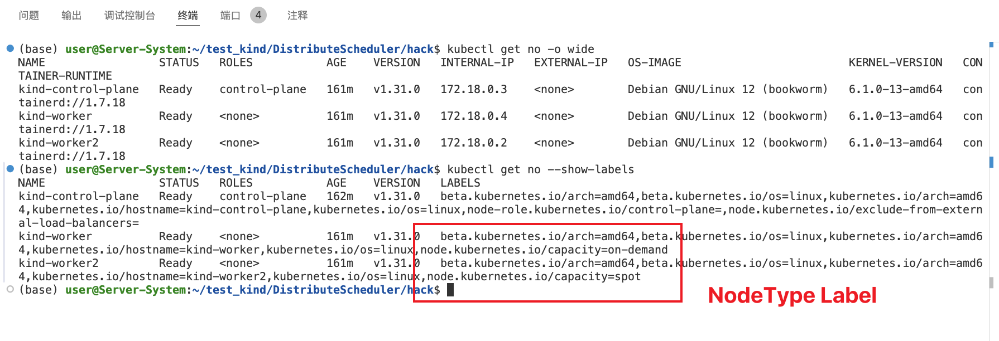
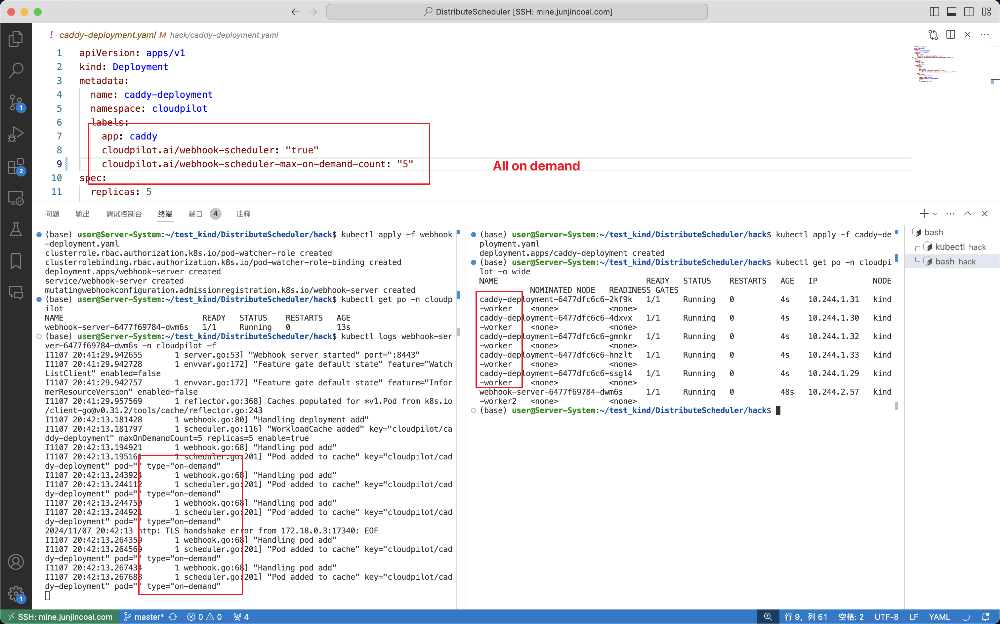
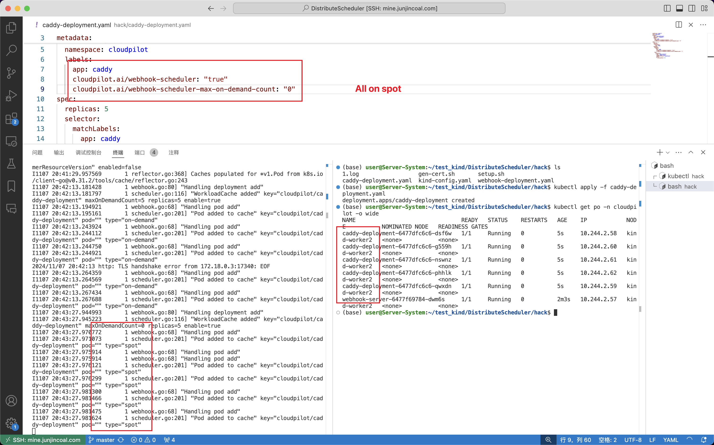
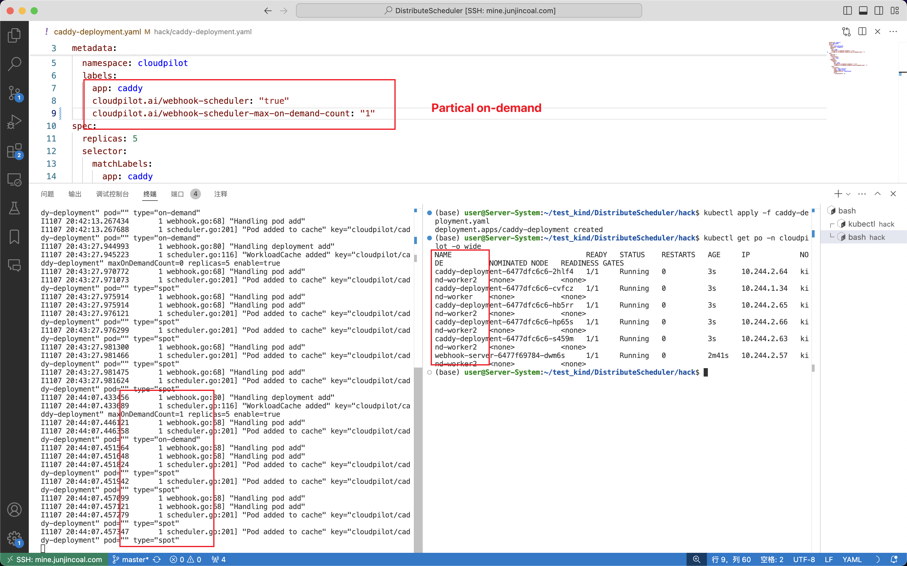

# Distributed Scheduling

## Background

In all cloud providers, like AWS, Google, and others, there are many spot instances. They are quite cheap (10% of the on-demand instances' price), but after you buy them, they could be terminated with only two minutes' notice in advance (in most scenarios, we don't set PDB, and we should perform the graceful drain).

So, I want you to design a strategy to maximize the use of spot instances without causing service interruptions, instead of relying solely on on-demand instances, to cut costs, by using distributed scheduling in a single cluster (on-demand/spot mixed or other methods for one workload). This is important because all spot instances being terminated at the same time could cause interruptions for different kinds of workloads (single replica workload, multiple replica workload).

Also, I don't want to change the scheduler already used in the K8s cluster and want to ensure the minimal components necessary in the cluster.

Notes:
> 1. On demand nodes has label: node.kubernetes.io/capacity: on-demand.
> 2. Spot node has label: node.kubernetes.io/capacity: spot.
> 3. Workloads represented as Deployments and StatefulSets.
> 4. on-demand/spot instance represented as K8s nodes in the cluster.
> 5. Only focus on scheduling control; the graceful drain after receiving the terminal notification is handled by other components.

### Design

[Distribute Scheduler Design](Design.md)

### Test

1. Create 2 workers in kind cluster, one is on-demand, and the other is spot.

```shell
kind create cluster --config kind-config.yaml
kubectl label nodes kind-worker node.kubernetes.io/capacity=on-demand
kubectl label nodes kind-worker2 node.kubernetes.io/capacity=spot
```



2. Generate tls certs for the webhook server.

```shell
cd hack
bash gen-certs.sh
```

Copy the result to the `hack/webhook-deployment.yaml` caBundle field.

3. Deploy the webhook server.

```shell
make build
docker pull docker.io/asklv/distribute-scheduler-e4d5f4c5df1f67132b3b0814894cf55d:latest
kind load docker-image docker.io/asklv/distribute-scheduler-e4d5f4c5df1f67132b3b0814894cf55d:latest
```

apply configs.

```bash
kubectl apply -f webhook-deployment.yaml
kubectl apply -f caddy-deployment.yaml
```

4. Result



